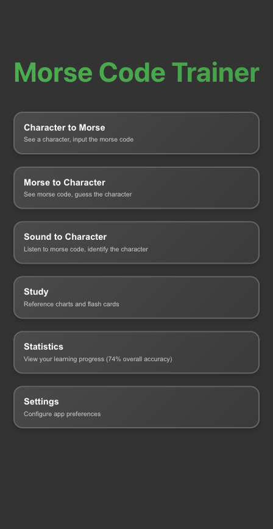

# Morse code trainer

An app I vibe-coded for practicing morse-code!

**🚀 [Try it live here!](https://morse-code.sumitgouthaman.com)**

Built using claude-code, Gemini CLI and Q CLI.

## Screenshots

| Main Menu | Game Modes | Statistics | Settings |
|:---:|:---:|:---:|:---:|
|  |  |  |  |

## Running the Application

Due to browser security restrictions, you need to run this application using a local web server.

1.  Open your terminal in the project's root directory.
2.  Run the following command to start a simple Python web server:

    ```bash
    python3 -m http.server
    ```

3.  Open your web browser and navigate to `http://localhost:8000`.

## Generating PWA Icons

The app uses a custom SOS signal favicon (`favicon.svg`) that needs to be converted to PNG format for PWA compatibility.

### Prerequisites
Install Inkscape for SVG to PNG conversion:
```bash
# macOS
brew install inkscape

# Ubuntu/Debian
sudo apt install inkscape

# Windows
# Download from https://inkscape.org/
```

### Generate Icons
Run these commands to create the required PNG icons from the SVG favicon:

```bash
# Generate 192x192 icon for PWA manifest
inkscape --export-type=png --export-width=192 --export-height=192 favicon.svg --export-filename=icon-192.png

# Generate 512x512 icon for PWA manifest  
inkscape --export-type=png --export-width=512 --export-height=512 favicon.svg --export-filename=icon-512.png
```

### Alternative Tools
If you don't have Inkscape, you can use other tools:

**ImageMagick:**
```bash
convert -background none -size 192x192 favicon.svg icon-192.png
convert -background none -size 512x512 favicon.svg icon-512.png
```

**rsvg-convert:**
```bash
rsvg-convert -w 192 -h 192 favicon.svg -o icon-192.png
rsvg-convert -w 512 -h 512 favicon.svg -o icon-512.png
```

The generated PNG files are required for the PWA manifest and will be cached by the service worker for offline use.

## Taking Screenshots

The project includes automated screenshot generation using Puppeteer to capture all app screens in both desktop and mobile viewports.

### Setup
1. Install dependencies:
   ```bash
   cd _scripts
   npm install
   ```

### Usage
```bash
# For local development (requires local server running)
cd _scripts
npm run screenshot-local

# For live GitHub Pages site
npm run screenshot-live

# For both local and live (comprehensive comparison)
npm run screenshot-both
```

All commands automatically generate both screenshots and animated GIFs.

### Output
Screenshots and animated GIFs are automatically saved to `_screenshots/` with organized subfolders:
```
_screenshots/
├── local/              # Local development screenshots
│   ├── desktop/        # Desktop viewport (1200x800)
│   │   ├── [screenshots]
│   │   ├── combined.gif      # All screens
│   │   └── game-modes.gif    # Just the 3 practice modes
│   └── mobile/         # Mobile viewport (448x867)
│       ├── [screenshots]
│       ├── combined.gif      # All screens
│       └── game-modes.gif    # Just the 3 practice modes
└── live/               # Live GitHub Pages screenshots
    ├── desktop/        # Desktop viewport (1200x800)
    │   ├── [screenshots]
    │   ├── combined.gif      # All screens
    │   └── game-modes.gif    # Just the 3 practice modes
    └── mobile/         # Mobile viewport (448x867)
        ├── [screenshots]
        ├── combined.gif      # All screens
        └── game-modes.gif    # Just the 3 practice modes
```

Each folder contains screenshots of:
- Main menu with all practice modes
- Settings modal interface  
- Character to Morse practice mode
- Character to Morse with spacebar paddle enabled
- Morse to Character practice mode
- Sound to Character practice mode
- Learn mode reference chart
- Statistics page with learning progression

Two animated GIFs are generated:
- **combined.gif**: Cycles through all 8 screens (1 second per frame)
- **game-modes.gif**: Shows just the 4 interactive practice modes (1 second per frame)
