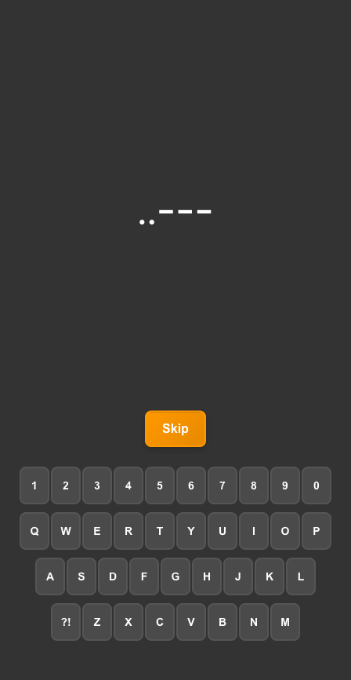
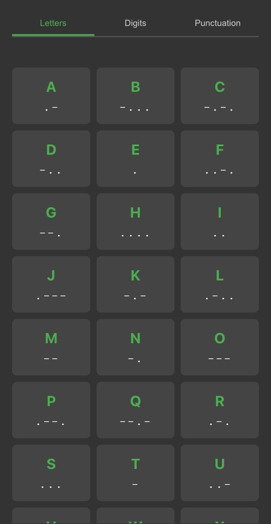

# Morse code trainer

An app I vibe-coded for practicing morse-code!

Built using Gemini CLI and Q CLI.

## Screenshots

| Main Menu | Character to Morse | Morse to Character | Sound to Character | Learn Mode |
|:---:|:---:|:---:|:---:|:---:|
|  |  |  |  |  |

## Running the Application

Due to browser security restrictions, you need to run this application using a local web server.

1.  Open your terminal in the project's root directory.
2.  Run the following command to start a simple Python web server:

    ```bash
    python3 -m http.server
    ```

3.  Open your web browser and navigate to `http://localhost:8000`.

## Taking Screenshots

The project includes automated screenshot generation using Puppeteer to capture all app screens in both desktop and mobile viewports.

### Setup
1. Install dependencies:
   ```bash
   cd _scripts
   npm install
   ```

### Usage
```bash
# For local development (requires local server running)
cd _scripts
npm run screenshot-local

# For live GitHub Pages site
npm run screenshot-live

# For both local and live (comprehensive comparison)
npm run screenshot-both
```

### Output
Screenshots are automatically saved to `_screenshots/` with organized subfolders:
```
_screenshots/
├── local/              # Local development screenshots
│   ├── desktop/        # Desktop viewport (1200x800)
│   └── mobile/         # Mobile viewport (375x667)
└── live/               # Live GitHub Pages screenshots
    ├── desktop/        # Desktop viewport (1200x800)
    └── mobile/         # Mobile viewport (375x667)
```

Each folder contains screenshots of:
- Main menu with all practice modes
- Settings modal interface
- Character to Morse practice mode
- Morse to Character practice mode
- Sound to Character practice mode
- Learn mode interface

## TODO
- Make PWA
- Icons, etc.
- Store stats